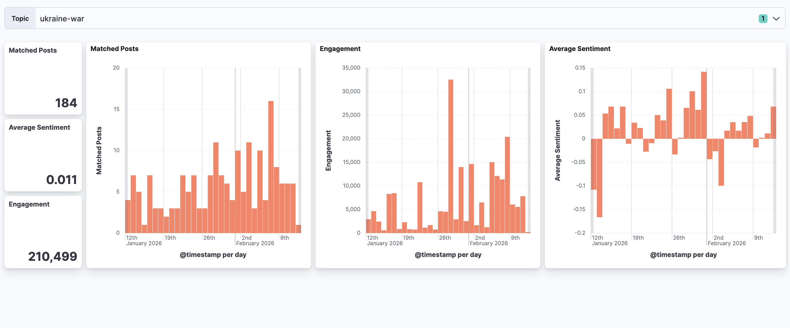

# Trend Insight

Trend Insight is a real-time trend tracking system, where the user can define topics, and each topic has a matching pattern in CNF (Conjunctive Normal Form) with keywords.
The system takes the matched posts from Reddit, applies sentiment analysis by using Spark, and shows the data on a dashboard.


## Architecture

[![](https://mermaid.ink/img/pako:eNqVVutu2jAUfhXL0iQqcWm5gxBS11KpK-1oU6nSmv4wiYEMsDPHacuAd9-xnZCEANsiRHzul5zvJGvscJfiLp4K4s_Q8MlmCK4gHBvG4FNSwcji1cbxEVk8FA4NbPxmlNX1RF3Xk4WCjc0JXY5ubXx2ZjQoc_f83rIpDaTHmUXFu-dQ8L9joYiHCg-QW_lncJYJ9cx9z_lKnPnEWyw8Nr3iLAiXVEDs3rivpSgl7lXG_d5Y9As9rz-O2CWptHoVT0ucyAGaCh76EOwsCXYZSm6tmAOOwL-iUETu1PLF3dMgIFPQgaruyGROMvnfE-nMqDvigQx0tuu1jXVC5aURlX0ls_F2m1gNmPCUzFjvG9JIespD3JNnEsz37cdJv8pSyRPTXXlDPg1ANns1jY7JdH8nXHwQ4ZbidEpROiWdzvF-v-010PKJmEPz9D3TPM25Ft67ft6aQoZEhdFKzjjLPj-tcbUIA5kyiOi84gsX83iQjKrhxDVCiQVT279WttfDO29MGIEA5rBTSCqXXJCpgkN0QkOyUqmmejCw1CMYLAigxQkoEc4s6aGesJX1OFQ6-pDI8pOqkabnFPB6IBRwC0YWYRKqrPRTuDyKgZGgAWWSKECD-xvBmVRa2aVBHKlXBtzRpe_n_X35gq6JJOhmwT8MJ9ovpVJ_8836_oA0jjZHt8JJoxS6jd4xL9oyAm5snMOxcZHy-R9W5j8nPOQhNanGKsXQ-vGqQHuGh1ZIykMEI-VBr4hNBjwpxYiT00znZP4PRTyZYrxUshvndFVWFMtSahHCbGaY-Z1nst5_SSCl8Lch2k0ksKXgi8xQqglWrp8G1jOQv0J4l230W5BFQNLix5CKVZJ0zAZ7t_IiPEk3Br1Z8bF88-XhIrzJPRd3pQhpEUPuS6JIvFYeYd3P6JLauAtHV-9Wm23BxifsB-fL2Ay213SGuxOyCIAKfZdIeu0RQHaiAhCl4oqHTOLuRa2jfeDuGn_ibql53iw3ap3zdqNe78APpCvc7dTKzVqz3arXW-1qtVHfFvFvHbRaBqrZaFWb7Ua1ftEqYgpo5eLefJroL5TtH0uI2yI?type=png)](https://mermaid.live/edit#pako:eNqVVutu2jAUfhXL0iQqcWm5gxBS11KpK-1oU6nSmv4wiYEMsDPHacuAd9-xnZCEANsiRHzul5zvJGvscJfiLp4K4s_Q8MlmCK4gHBvG4FNSwcji1cbxEVk8FA4NbPxmlNX1RF3Xk4WCjc0JXY5ubXx2ZjQoc_f83rIpDaTHmUXFu-dQ8L9joYiHCg-QW_lncJYJ9cx9z_lKnPnEWyw8Nr3iLAiXVEDs3rivpSgl7lXG_d5Y9As9rz-O2CWptHoVT0ucyAGaCh76EOwsCXYZSm6tmAOOwL-iUETu1PLF3dMgIFPQgaruyGROMvnfE-nMqDvigQx0tuu1jXVC5aURlX0ls_F2m1gNmPCUzFjvG9JIespD3JNnEsz37cdJv8pSyRPTXXlDPg1ANns1jY7JdH8nXHwQ4ZbidEpROiWdzvF-v-010PKJmEPz9D3TPM25Ft67ft6aQoZEhdFKzjjLPj-tcbUIA5kyiOi84gsX83iQjKrhxDVCiQVT279WttfDO29MGIEA5rBTSCqXXJCpgkN0QkOyUqmmejCw1CMYLAigxQkoEc4s6aGesJX1OFQ6-pDI8pOqkabnFPB6IBRwC0YWYRKqrPRTuDyKgZGgAWWSKECD-xvBmVRa2aVBHKlXBtzRpe_n_X35gq6JJOhmwT8MJ9ovpVJ_8836_oA0jjZHt8JJoxS6jd4xL9oyAm5snMOxcZHy-R9W5j8nPOQhNanGKsXQ-vGqQHuGh1ZIykMEI-VBr4hNBjwpxYiT00znZP4PRTyZYrxUshvndFVWFMtSahHCbGaY-Z1nst5_SSCl8Lch2k0ksKXgi8xQqglWrp8G1jOQv0J4l230W5BFQNLix5CKVZJ0zAZ7t_IiPEk3Br1Z8bF88-XhIrzJPRd3pQhpEUPuS6JIvFYeYd3P6JLauAtHV-9Wm23BxifsB-fL2Ay213SGuxOyCIAKfZdIeu0RQHaiAhCl4oqHTOLuRa2jfeDuGn_ibql53iw3ap3zdqNe78APpCvc7dTKzVqz3arXW-1qtVHfFvFvHbRaBqrZaFWb7Ua1ftEqYgpo5eLefJroL5TtH0uI2yI)

### Ingestion service (`Node.js`)

There two core components in the ingestion service:

- **Syncing Worker**: An infinite loop that fetches all the topics from the system API every 1 minute. For each topic, it queries the matching Reddit posts of the last 48 hours, in order to keep the number of upvotes and comments of the matched posts up to date.
- **Topic Backfilling Worker**: A Kafka consumer that listens for topic-backfilling tasks. For each topic-backfilling task, it queries the matched-posts of the last 30 days of the given topic.

### Kafka

There are 3 Kafka topics:

- `topic.matched.posts` (8 partitions): Matched posts of topics.
- `topic.enriched.matched.posts` (1 partitions): Matched posts of topics with sentiment attribute.
- `topic.backfilling.tasks` (1 partitions): Backfilling tasks for topics.

I dediced 8 partitions for the `topic.matched.posts` topic because in this way 8 Spark tasks are created for each micro-batch, and I can process all of them in parallel and use the full potential of my Spark worker.

**Note:** since the number of cores of the Spark worker is the same of the number of cores of your machine, if your machine have a different number of cores you can change the number of partitions in the `docker-compose.yml` file as you wish.

There are 3 consumer groups:

- `backfill-topic`: consumers (Ingestion Service) that performs topic backfilling.
- `enrich-matched-posts`: consumers (Spark executors) that enriches matched posts with sentiment attribute.
- `forward-enriched-matched-posts`: consumers (Logstash) that forwards enriched matched posts to Elasticsearch.

### Spark Sentiment Analyzer (`Python`)

After the ingestion of the matched posts of topics, Spark runs a sentiment analysis on them, and writes the enriched records into Kafka.

### Logstash

It reads the enriched records from Kafka, add the field `@timestamp` based on the `timestamp` field, and forwards them to Elasticsearch.

### API & Dashboard

The Express.js API uses MySQL to store the topics and it uses Elasticsearch to calculate metrics per time window (1 day, 7 days, 30 days). The metrics are then served to the front-end.

### Kibana

It's used to visualize metrics from Elastisearch data.

## Tech Stack

- **Front-end**: React, Shadcn UI.
- **Back-end**: Node.js, Express.js, MySQL.
- **DevOps**: Kafka, Spark, Elasticsearch, Logstash, Docker.

## Getting Started

1.  **Clone the repo**

    ```bash
    git clone https://github.com/Eatrak/trend-insight.git
    cd trend-insight
    ```

2.  **Start Services (Docker)**

    ```bash
    cd back-end
    cp .env.template .env
    # Add your OPENAI_API_KEY for the AI features
    docker-compose up -d --build
    ```

    _Note: It takes about 30s for Kafka and Elastic to become healthy._

3.  **Configure Kibana (Optional)**

    To enable the Kibana dashboard:
    1.  Go to [http://localhost:5601/app/management/kibana/objects](http://localhost:5601/app/management/kibana/objects)
    2.  Click **Import**
    3.  Select `back-end/kibana/dashboard.ndjson`
    4.  Click **Import**

    

4.  **Start Frontend**

    ```bash
    cd ../front-end
    npm install
    npm run dev
    ```

5.  **Access**
    - **Frontend**: http://localhost:5173
    - **API**: http://localhost:8000
    - **Kibana**: http://localhost:5601
    - **Kafka UI**: http://localhost:8085
    - **Spark UI**: http://localhost:8080
