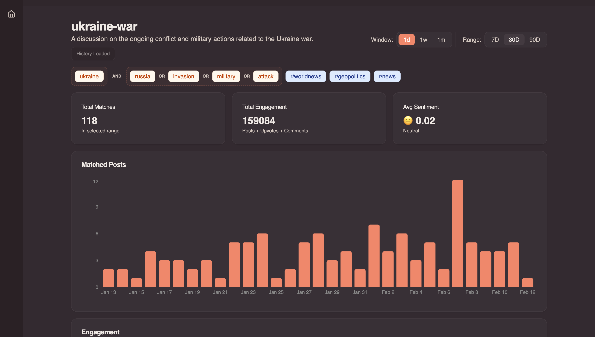
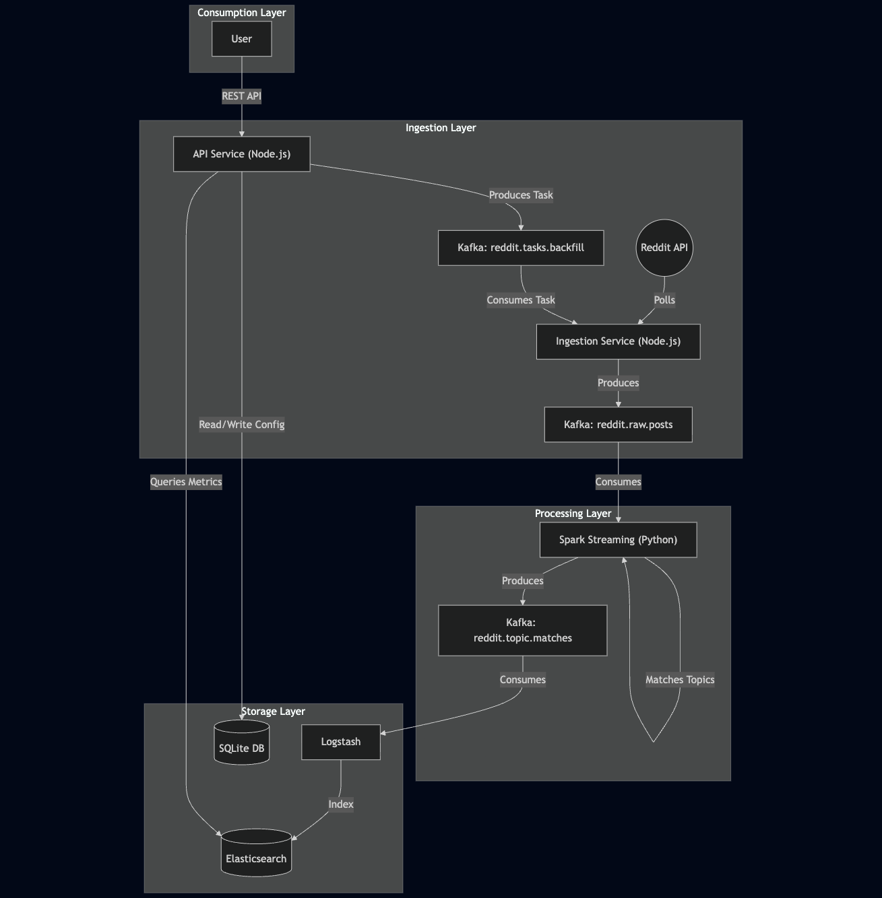

# Trend Insight Backend

A high-performance, real-time data pipeline for tracking and analyzing Reddit trends. This system ingests data from Reddit, processes it using Spark Structured Streaming for topic detection, and visualizes insights via an API and Elasticsearch.



## 🌟 Why Trend Insight?

In a world where social media trends move at light speed, understanding what is being discussed and how fast it's growing is very useful.

### ⚡️ Real-Time Detection

Trend Insight uses **Spark Structured Streaming** to detect detailed topics the moment they are mentioned.

### 🎯 Precision via CNF Logic

Simple keyword matching is often inaccurate. We use **Conjunctive Normal Form (CNF)** logic (e.g., `(crypto OR bitcoin) AND (crash OR dip)`), ensuring high-quality signals.

### ⏳ Historical Backfilling

Trend Insight uses a **dual-mode ingestion** to allow you to instantly backfill historical data up to 1 month for any new topic, giving you immediate insights.

### 📈 Metrics

The system calculates for each topic the various metrics along the timeline:

- the number of related posts
- the engagement (posts + upvotes + comments)
- the growth rate of the topic

### 🤖 AI-Powered Configuration

The system uses **OpenAI** to translate natural language descriptions into precise topic rules, so that the creation of a topic is fast and easy.

## 🏗 Architecture



## 🚀 Services Overview

### 1. **Ingestion Service** (`node-ts`)

- **Role**: Continuously polls Reddit for new posts in monitored subreddits.
- **Features**:
  - Real-time polling with deduplication.
  - Handles historical backfill requests triggered by the API.
- **Key Config**: `REDDIT_POLL_INTERVAL_SECONDS`, `REDDIT_LIMIT`.

### 2. **Spark Streaming** (`pyspark`)

- **Role**: Processes the raw stream of Reddit posts to identify user-defined topics.
- **Features**:
  - Uses **Structured Streaming** for fault-tolerant processing.
  - **Dynamic Configuration**: periodic polling of the API for new topic definitions.
  - **CNF Matching**: Supports complex `(A OR B) AND (C)` keyword logic.
  - **Output**: Writes matched events to a dedicated Kafka topic.

### 3. **API Service** (`express-ts`)

- **Role**: The control plane for the platform.
- **Features**:
  - **Topic Management**: CRUD operations for topics (stored in SQLite).
  - **Metrics**: Aggregates data from Elasticsearch on-the-fly (Compute-on-Read).
  - **AI Integration**: Uses OpenAI to generate topic configurations from natural language descriptions.
- **Endpoints**:
  - `POST /topics`: Create a new topic.
  - `POST /topics/:id/backfill`: Trigger historical data backfill.
  - `GET /topics/:id/report`: Get metrics for a topic.

### 4. **Storage & Infrastructure**

- **Kafka**: The central event bus. Buffers raw posts and matched posts.
- **Elasticsearch**: Stores granular matched events for flexible aggregation.
- **Logstash**: Syncs data from Kafka to Elasticsearch.
- **SQLite**: Stores lightweight configuration data (topics, rules).

## 🛠 Prerequisites

- **Docker** and **Docker Compose** (Required)
- **Node.js 18+** (for local development)
- **Python 3.9+** (for local development)

## 🚦 Getting Started

1.  **Clone the repository**

    ```bash
    git clone https://github.com/your-repo/trend-insight.git
    cd trend-insight/back-end
    ```

2.  **Configure Environment**
    Copy the template and fill in your details (especially `OPENAI_API_KEY`).

    ```bash
    cp .env.template .env
    ```

3.  **Start Services**

    ```bash
    docker-compose up -d --build
    ```

    _Note: Kafka will take at least 15 seconds to be ready, so do not use the app until then._

4.  **Verify Running Services**
    ```bash
    docker-compose ps
    ```

## 🔌 Access Points

| Service          | URL                     | Description                  |
| :--------------- | :---------------------- | :--------------------------- |
| **API**          | `http://localhost:8000` | Main REST API                |
| **Kafka UI**     | `http://localhost:8085` | Inspect topics and messages  |
| **Kibana**       | `http://localhost:5601` | Visualize Elasticsearch data |
| **Spark Master** | `http://localhost:8080` | Monitor Spark jobs           |
| **Spark Worker** | `http://localhost:8081` | Monitor Spark worker         |
